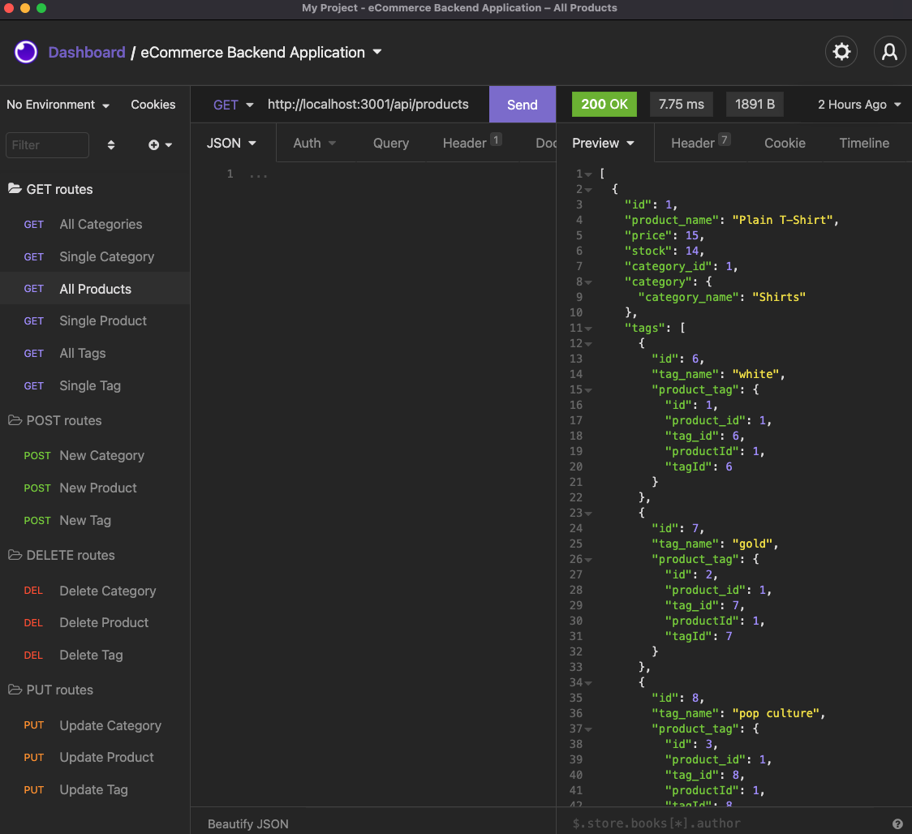

# e-commerce_backend_application

This is a simple application that allows the user to view, add, delete and update data stored in a database using Sequelize. Please see below for more detailed steps in how the user interacts with this application.

## Accessing the application
This code is tested through Insomnia. Below is a link to the demo video as well as the Github repo.

**URL to Application Demo:**  https://youtu.be/pEZbf8C7YAM

**Github Repo:** https://github.com/bckasper/e-commerce_backend_application

## Instructions for use
**Below is a detailed breakdown of how this application works:**

1. The user must first have the Insomnia application to test this program. This can be downloaded here: https://insomnia.rest

2. The user will need to have MySQL downloaded and will need to sign in. Once signed in, the user can SOURCE the schema and seeds file in the db folder on the directory.

3. With the database activated and data stored, the user can exit MySQL in their terminal and run the application.

4. Enter Node config/connections to make sure the connection is set up to the database. Then run Node seeds/index.js to seed the database. You are now ready to run the application.

5. Enter node server.js or npm start to run the application
    
6. Go into Insomnia and set up a new connection. You are able to test GET, POST, PUT, and DELETE requests for the Category, Products, and Tags tables. the link is http://localhost:3001/api/"table_name"

7. For individual requests, you will need to enter a "/:id" for the id of the target database record.

## Screenshots of Insomnia test
 

## Contributors
This was a solo project developed by me.

## Technology used in this application
1. This application primarily uses MySQL (https://www.mysql.com)

2. The API routing was created via Express.js (https://expressjs.com)

3. Insomnia to test API methods (GET, POST, PUT, DELETE): (https://insomnia.rest)